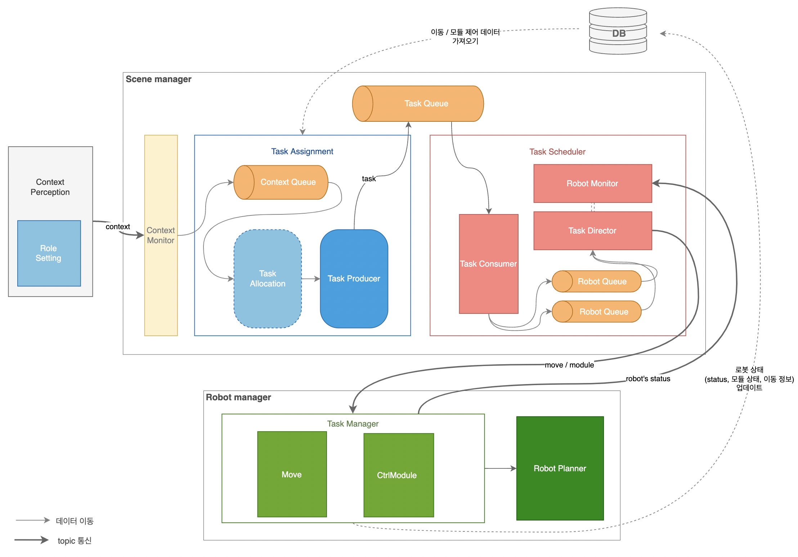

# Architecture
Task Manager와 Robot Planner는 Robot Manager로 묶여 **로봇 내에서 동작함**



## 1. Task Manager
Scene Manager로부터 Task를 위한 로봇의 세부동작을 받고, 그 동작을 순서대로 이행하는지 감시하고 관리

| 상태 | 설명 |
|--|--|
| **Move** | 이동 명령 ->  이동 중 (대기) -> 이동 완료 알림 |
| **Module** | 모듈 제어 명령 -> 모듈 제어 토픽 발행 여부 대기 -> 모듈 제어 토픽 발행 완료 알림 |

## 2. Robot Planner
Robot Planner는 Task Manager로부터 명령받은대로 실제 동작하도록 함

<br/>


# Prerequisites

## 1. System
테스트를 진행했던 서버 환경은 다음으로 구성되어 있습니다. 
- **Hardware**: Turtlebot3 waffle 
- **Operating System**: Ubuntu 20.04.6 LTS
- **Kernel**: Linux 5.4.0-200-generic
- **ROS version**: noetic
- **Manual SBC Setup for TurtleBot3** 완료 ([Robotis Emanual 하단 'expand' 참고](https://emanual.robotis.com/docs/en/platform/turtlebot3/sbc_setup/#sbc-setup))

## 2. Install packages
실행을 위해 필요한 패키지를 설치합니다.
```bash
sudo apt update

sudo apt install python3-pip mysql-server ros-noetic-smach ros-noetic-smach-ros
pip3 install mysql-connector-python python-dotenv
```

## 3. Environment Variable
dotenv를 사용해 환경변수 저장 (데이터베이스에 접근 시 필요)
- **src/ 폴더 아래에 .env 파일을 추가해주세요**
- 아래의 내용이 .env에 포함되어야 하고, 각 변수값은 수정해야 합니다.
```
DB_HOST={server_ip}
DB_USER={granted_user}
DB_PASSWORD={granted_password}
DATABASE={schema_name}
```

## 4. ~/.bashrc
```bash
source /opt/ros/noetic/setup.bash
source ~/catkin_ws/devel/setup.bash

export ROS_MASTER_URI=http://{server-ip}:11311
export ROS_HOSTNAME={robot-ip}
export TURTLEBOT3_MODEL=waffle
export LDS_MODEL=LDS-02
export OPENCR_MODEL=waffle_noetic
export OPENCR_PORT=/dev/ttyACM0
export ROBOT_NAME={robot-name}
```

<br/>

# Run
```bash
cd ~/catkin_ws/src/
git clone https://github.com/lnalice/robot-task-manager.git
git clone https://github.com/lnalice/robot-planner.git
mv robot-task-manager task_manager
source ~/.bashrc # 혹은 source ~/catkin_ws/devel/setup.bash

## robot manager 실행
ROS_NAMESPACE=$ROBOT_NAME roslaunch task_manager robot_manager.launch multi_robot_name:=$ROBOT_NAME
```
<br/>

# Communication

## 1. Topic

| 토픽 | 설명 | 메시지 데이터 분류
|--|--|--|
|**/task_scheduler/{robot_name}** | 로봇 별 이동 및 모듈제어를 명령받음 | Action |
|**/task_scheduler/robot_status** | 로봇 상태 업데이트 | Status |
|**/{robot_name}/task_manager/ctrl_module_req** | robot planner에 모듈제어 요청 | Action |
|**/{robot_name}/task_manager/ctrl_module_res** | robot planner가 모듈제어 응함 | Action |
|**/{robot_name}/task_manager/move_req** | robot planner에 이동 요청 | Action |
|**/{robot_name}/task_manager/move_res** | robot_planner가 이동 응함 | Action |


## 2. Message Data
아래의 표는 토픽으로 전달되는 데이터에 대해 설명합니다.

| 분류 | 자료형 | 데이터 구조 | 예시 |
|--|--|--|--|
| Action(MOVE) | String | MOVE `로봇` `seconds` `직진속도`  `각속도` `delay(sec)` | "MOVE tb3_0 10 0.07 -0.01 0" |
| Action(MODULE) | String | MODULE `로봇` `수직 모터 각도차` `수평 모터 각도차` `delay(sec)`| "MODULE tb3_0 1380 650 0"|
| Status | String | `Action` \| IDLE   `로봇` | "IDLE tb3_0", "MOVE tb3_1" |


# File Structure
```
├── CMakeLists.txt
├── package.xml
├── assets
│   ├── architecture1.png
│   ├── architecture2.png
│   ├── sm_graph1.png
│   └── sm_graph2.png
├── launch
│   └── robot_manager.launch
└── src
    ├── .env
    ├── dao
    │   ├── db
    │   │   ├── config.py
    │   │   └── connection.py
    │   ├── RobotDao.py
    │   ├── moduleDao.py
    │   ├── moveDao.py
    │   └── sceneModuleDao.py
    ├── state_machines
    │   ├── control
    │   │   └── control_module.py
    │   ├── move
    │   │   └── move_one.py
    │   └── request_handler.py
    └── task_manager.py
```

- **dao/**
    - **db/\*** : 데이터베이스에 연결을 위해 설정을 하고 연결 3회 시도
    - **\*Dao.py**: MySQL에 query를 보내, *INSERT, UPDATE, SELECT* 등 실행